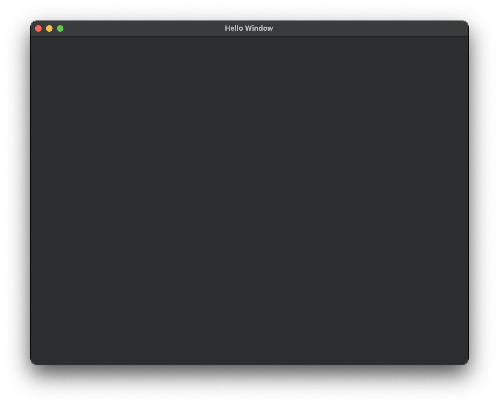

# NUIXT
Native UI X (cross-platform) Toolkit is a declarative, cross-platform C++20 conforming library that directly calls native platform GUI backends.

> [!IMPORTANT]
> This README.md is currently incomplete and will be updated progressively over time to include more developer information.